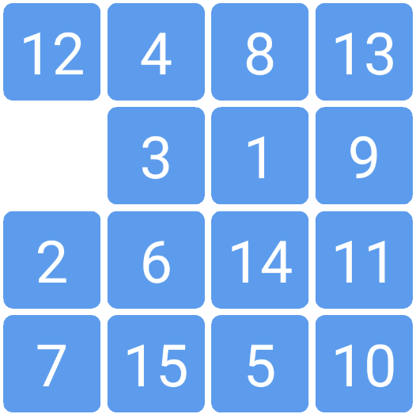
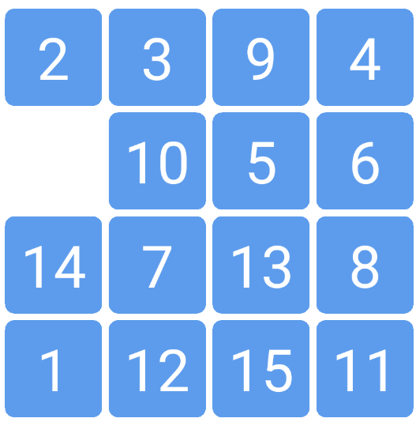

# 基于A* 算法和降阶法的四阶数字华容道问题快速求解方法

视频演示见 https://b23.tv/BV1az4y1X72f 

* 四阶数字华容道（15P）的复杂度相较于三阶的有非常大的提升。使用普通bfs算法三阶可能需要几秒而四阶就到了几分钟。
* 这里使用了A* 算法和降阶法结合的思路对四阶进行快速求解。得到的解并不是全局最优解，而是分三步的三个最优解的和。快的时候不到一秒出解，慢的时候可能到十秒左右。
* 视频中主要耗时在第一步读取数字上，pytesseract准确率不咋样还很耗时。。其实只是识别15个数字，可以尝试图片匹配等思路快速读取。

仅上传了求解过程的代码，而且这个代码感觉非常冗余，好多部分都是重复的，暂时懒得改进了。

****
* 2020/7/1 略微修改了一下，使得降阶法在递归上的优势性更加明显，之前写的确实太蠢了。打算试试推广到更高的puzzle上，不过搜索时间会爆炸是肯定的了。。结果这种方法在四阶就已经爆炸了，有时候搜索两分钟甚至更多才能出结果，时间上的消耗是不值当的，所以干脆上传两种方法了。。

* solve.py 使用递归法，先算第一行加第一列，再算剩余的8P，步数更少，非常耗时。
* solve_1.py 先算第一行，再算第一列，再算剩余的8P，步数略多，但基本可以在10s以内给出一个解。

****

以这个为例：solve_1.py求解过程0.177秒，步数61步。solve.py 求解过程100.5秒，步数65步。

以这个为例：solve_1.py求解过程0.09秒，步数49步。solve.py 求解过程2.1秒，步数41步。

****
2020/8/31 又想起这些代码，其实后来发现直接在整体上进行A* 算法求解也还可以，对于那些少于40步的puzzles，往往可以很快速的给出答案。制作了一个极其简易版求解网页。
